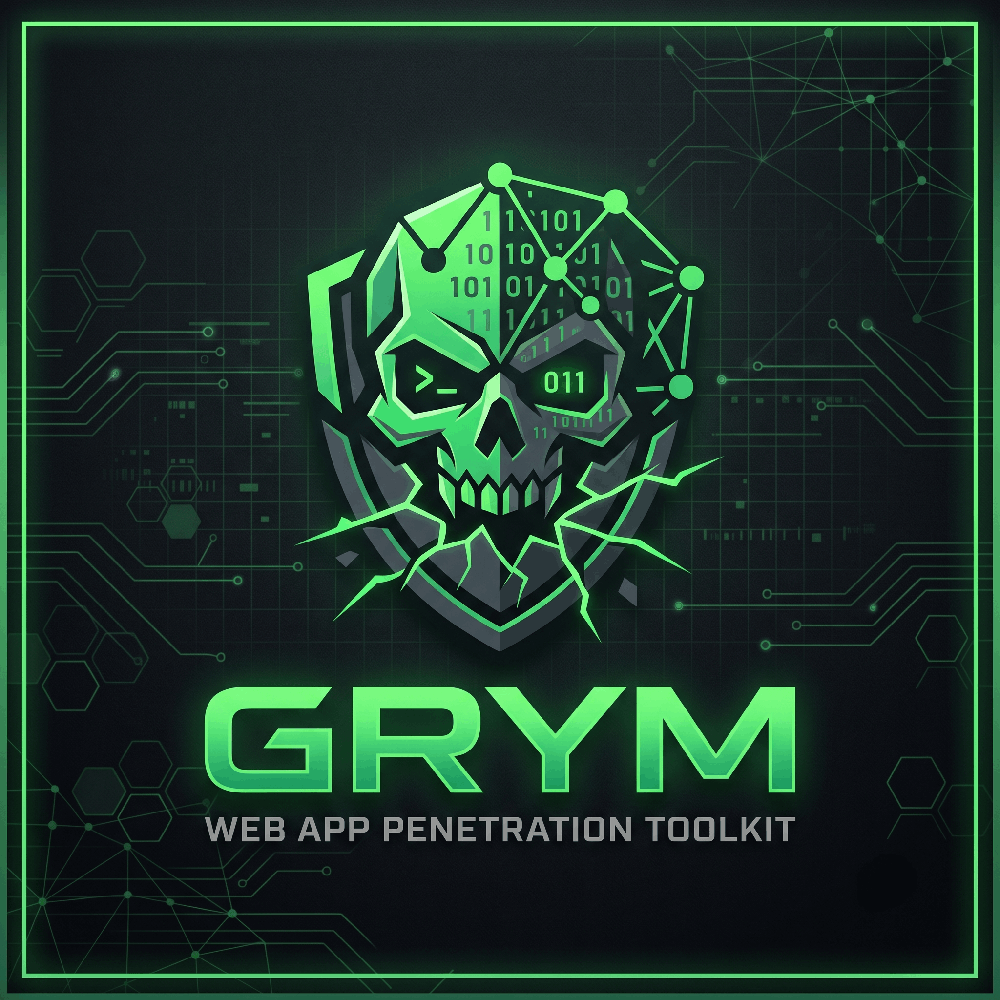
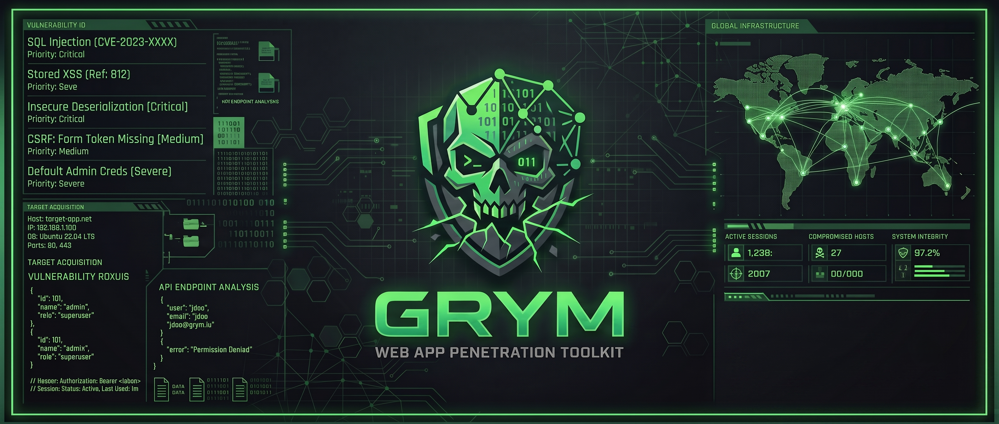
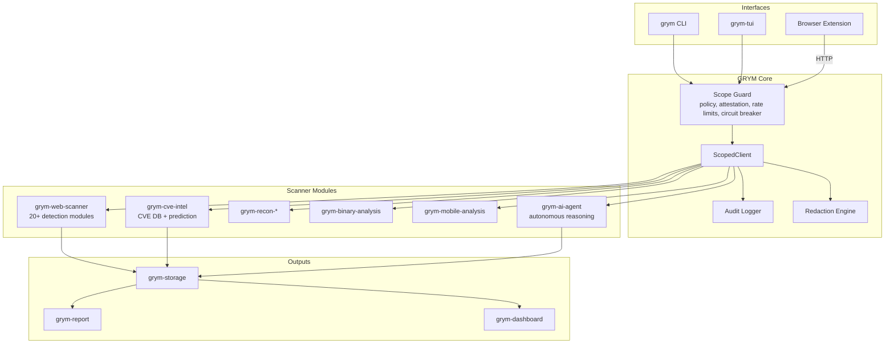

<p align="center">
  
</p>

<p align="center">
  
</p>

<p align="center">
  <a href="https://www.rust-lang.org"></a>
  <a href="LICENSE.md"></a>
  
  
  <a href="docs/ARCHITECTURE.md"></a>
</p>

# GRYM

> A Rust-native security assessment toolkit that is **paranoid by default**.  
> If you are looking for a tool that will cheerfully scan the public internet for you, this is not it.  
> If you want a tool that treats "Are you absolutely sure you are authorized?" as a first-class architectural primitive, pull up a chair.

GRYM is a web-application penetration-testing and vulnerability-research platform built for explicitly authorized, time-bounded engagements. Every outbound byte is funneled through a centralized **Scope Guard** that enforces deny-first policy, operator attestation, rate limits, circuit breakers, and audit logging. The scanners are fast, the exploit generation is expressive, and the safety model is deliberately annoying in all the right ways.

---

## Table of contents

- [What makes GRYM different](#what-makes-grym-different)
- [High-level architecture](#high-level-architecture)
- [Features](#features)
- [Installation](#installation)
- [Quick start](#quick-start)
- [CLI reference](#cli-reference)
- [Local HTTP API](#local-http-api)
- [Browser extension](#browser-extension)
- [Safety model](#safety-model)
- [Workspace crates](#workspace-crates)
- [FAQ](#faq)
- [Contributing](#contributing)
- [License](#license)
- [Disclaimer](#disclaimer)

---

## What makes GRYM different

Most offensive tools assume the operator knows what they are doing. GRYM assumes the operator is one coffee away from pointing a scanner at production and therefore forces every action through a typed, auditable, deny-first scope guard. The design is staged: the foundation is executable today, and the riskier modules live behind clear boundaries so they cannot accidentally bypass the safety model as the platform grows.

The guiding principles are:

1. **Fail-closed by default.** If scope cannot be verified, the request is denied.
2. **Attestation is not optional.** Active techniques require a typed, in-memory authorization phrase.
3. **Defense in depth.** Rate limits, circuit breakers, redirect re-authorization, and evidence redaction are not afterthoughts.
4. **Exploration without destruction.** Detection is response-signature based and non-destructive by default; active validation is gated behind technique tiers.
5. **Batteries included, safety first.** CVE correlation, exploit generation, zero-day prediction, multi-step attack chains, and an AI agent are built in, but they are all scoped.

---

## High-level architecture



For the deep dive, see [`docs/ARCHITECTURE.md`](docs/ARCHITECTURE.md).

---

## Features

### Scope-first everything

- `grym_core::ScopedClient` is the only HTTP transport exposed to module crates.
- Deny rules take precedence over allow rules.
- Redirects are disabled in the underlying client and re-authorized manually, one hop at a time.
- Audit-write failures fail the action closed.
- Evidence is redacted before it is stored or reported.

### Web vulnerability scanner

`grym-web-scanner` currently includes 20+ detection modules:

| Module | What it looks for |
| --- | --- |
| SQL Injection | Error-based, union-based, blind boolean, and time-based payloads |
| XSS | Reflected and stored script injection patterns |
| SSTI | Template injection signatures across multiple engines |
| SSRF | Server-side request forgery indicators |
| Command Injection | Shell metacharacter and command chaining patterns |
| Path Traversal | Directory traversal and file inclusion signatures |
| Open Redirect | Host/header and parameter-based redirect abuse |
| IDOR | Insecure direct object reference heuristics |
| JWT Security | Weak algorithms, missing claims, exposed keys |
| CORS Misconfiguration | Overly permissive origin and credential headers |
| Host Header Injection | Host/port override and virtual host confusion |
| HTTP Request Smuggling | Content-Length / Transfer-Encoding disagreements |
| XXE | XML external entity indicators |
| CSRF | Missing anti-CSRF tokens and unsafe state-changing verbs |
| GraphQL | Introspection, depth limits, batching, cost analysis |
| NoSQL Injection | MongoDB and JSON-based injection patterns |
| WAF Detection | Response anomalies that reveal protection layers |
| Technology Fingerprinting | Headers, bodies, cookies, script paths, CMS signs |
| Fuzzer | Intelligent payload mutation and anomaly scoring |
| Attack Chain Builder | Multi-step chains with MITRE ATT&CK mapping |

### CVE intelligence and prediction

- `grym-cve-intel` ships a curated database of **525+ CVE entries** with signatures, affected versions, CVSS, remediation, and references.
- Correlate a technology fingerprint against the database to find known exploitable versions.
- Generate auto-PoCs in Python, Go, Rust, curl, Bash, PowerShell, Nuclei YAML, Metasploit Ruby, Node.js, Java, PHP, HTTPie, Burp Intruder, Ruby, Perl, Lua, and C#.
- Reverse-shell and web-shell generation for authorized red-team exercises.
- Zero-day prediction engine: estimate future risk for a component and version based on historical patterns, CWE correlations, and response analysis.

### AI agent

- `grym-ai-agent` provides session management, multi-model reasoning, tool registry, and autonomous CVE hunting.
- It can analyze a target description, generate hypotheses, and propose PoC templates.
- Like every other module, it cannot touch the network without going through the Scope Guard.

### Browser extension

A Manifest V3 add-on that works in Chromium, Firefox, and Edge:

- Popup with server status, quick scan, and dashboard link.
- Full-page dashboard with tabs: **Scanner**, **Findings**, **CVE DB**, **Exploit Gen**, and **Predict**.
- Content script detects in-page technologies, secrets, forms, and endpoints.
- Talks to the local `grym serve` API at `http://localhost:9378`.
- Uses the GRYM logo for toolbar and extension icons.

### CLI and TUI

- `grym scope validate` — validate a scope file with zero network access.
- `grym scope show` — render the effective policy.
- `grym serve` — start the local HTTP API for the extension and automation.
- `grym-tui` — a keyboard and mouse-driven terminal interface with a built-in help overlay.

### Manual pentest playbook (core feature)

A built-in reference and methodology layer for hands-on testing — no network access, no separate mode, just first-class CLI commands, API endpoints, and TUI tabs:

- **Payload library** — curated sets for SQLi (union/error/blind/time), XSS (reflected/stored/polyglot), SSTI, SSRF, XXE, path traversal, NoSQLi, open redirect, command injection, JWT, and more, each with when-to-use context, tags, and difficulty ratings.
- **Technique references** — step-by-step walkthroughs (e.g. JWT alg-confusion, auth bypass, union enumeration) with the concept, ordered manual steps, success indicators, and related payload sets.
- **Methodology checklist** — a phased web-app pentest methodology (recon → mapping → discovery → exploitation → post-exploit → reporting) you can render to markdown and track progress on.
- **Engagement plan generator** — feeds your `scope.toml` (tier, deepness, engagement id) plus a target profile into an ordered, weighted step plan with suggested payload sets.

```bash
grym playbook payloads                     # list all payload sets
grym playbook payloads sqli-union          # show one set
grym playbook payloads --search polyglot  # keyword filter
grym playbook techniques                   # list technique references
grym playbook techniques jwt-alg-confusion # show one technique
grym playbook search "ssrf cloud"          # search payloads + techniques
grym playbook checklist                    # render methodology checklist
grym playbook checklist --out plan.md      # write it to a file
grym playbook plan -u http://target --tech php,mysql --authenticated \
    --out engagement.md                    # generate an engagement plan
```

### Reporting and storage

- Structured findings with severity, confidence, evidence, and remediation.
- Redaction of secrets, tokens, and query parameters before persistence.
- JSON and report-friendly outputs.

---

## Installation

### Prerequisites

- Rust 1.94 or later. The project uses `rust-toolchain.toml` to pin the toolchain.
- A working internet connection for the initial `cargo build`.
- A healthy respect for authorization boundaries.

### One-line install (recommended)

#### Linux / macOS (bash/zsh)

```bash
curl -fsSL https://raw.githubusercontent.com/Karmanya03/grym/main/scripts/install.sh | sh
```

The installer auto-detects your OS, architecture, and libc flavor (glibc vs musl),
downloads the matching release archive, installs into a writable directory
(usually `~/.local/bin` or `/usr/local/bin`), and adds it to your PATH.

To install the TUI instead of the CLI:

```bash
curl -fsSL https://raw.githubusercontent.com/Karmanya03/grym/main/scripts/install.sh | sh -s -- --bin grym-tui
```

To force the glibc-free static Linux build (musl):

```bash
curl -fsSL https://raw.githubusercontent.com/Karmanya03/grym/main/scripts/install.sh | sh -s -- --musl
```

Other useful options:

```bash
curl -fsSL .../install.sh | sh -s -- --install-dir /usr/local/bin --bin grym-tui --version v0.1.0
```

#### Windows (PowerShell)

```powershell
irm https://raw.githubusercontent.com/Karmanya03/grym/main/scripts/install.ps1 | iex
```

The installer downloads the Windows release, installs to `%LOCALAPPDATA%\Programs\Grym`,
and adds that directory to your user PATH.

To install the TUI or pin a version:

```powershell
& ([scriptblock]::Create((irm https://raw.githubusercontent.com/Karmanya03/grym/main/scripts/install.ps1))) -Bin grym-tui -Version v0.1.0
```

Or use environment variables:

```powershell
$env:GRYM_BIN = "grym-tui"; $env:GRYM_VERSION = "v0.1.0"; irm https://raw.githubusercontent.com/Karmanya03/grym/main/scripts/install.ps1 | iex
```

### Build from source

```bash
git clone https://github.com/Karmanya03/grym.git
cd grym
cargo build -p grym-cli --release
```

The `grym` binary will be at `target/release/grym`.

### Build the TUI

```bash
cargo build -p grym-tui --release
```

### Build the browser extension

No build step is required. The extension in `browser-ext/` is plain HTML/CSS/JS and can be loaded directly as an unpacked extension.

---

## Quick start

### 1. Validate a scope file

```bash
cargo run -p grym-cli -- scope validate config/scope.example.toml
```

This confirms the policy parses and obeys the deny-first rules without touching the network.

### 2. Start the local API

```bash
cargo run -p grym-cli -- serve
```

The server binds to `127.0.0.1:9378` by default. It uses a development scope that allows traffic to all targets; for real engagements, pass `--scope ./your-scope.toml`.

### 3. Run a scan

```bash
curl -X POST http://localhost:9378/scan \
  -H "Content-Type: application/json" \
  -d '{"target":"http://localhost:8080","scan_types":["all"]}'
```

### 4. Look up a CVE

```bash
curl http://localhost:9378/cve/CVE-2021-44228
```

### 5. Generate an exploit

```bash
curl -X POST http://localhost:9378/exploit \
  -H "Content-Type: application/json" \
  -d '{"cve_id":"CVE-2021-44228","format":"python","target":"http://target:8080"}'
```

### 6. Predict zero-day risk

```bash
curl -X POST http://localhost:9378/predict \
  -H "Content-Type: application/json" \
  -d '{"component":"Apache Struts","version":"2.5.10"}'
```

### 7. Load the extension

1. Open `chrome://extensions` or `edge://extensions`.
2. Enable **Developer mode**.
3. Click **Load unpacked**.
4. Select the `browser-ext/` directory.
5. Pin the Grym icon and open the dashboard.

For Firefox, use `about:debugging` → **This Firefox** → **Load Temporary Add-on** → select `browser-ext/manifest.json`.

---

## CLI reference

```bash
grym scope validate <path>      # Validate a scope TOML/JSON file
grym scope show <path>          # Print the effective policy
grym serve                      # Start the local HTTP API
grym serve --host 127.0.0.1 --port 9378 --scope ./scope.toml
grym playbook payloads          # List payload sets (add an id for detail)
grym playbook techniques        # List technique references
grym playbook search <query>    # Search payloads and techniques
grym playbook checklist         # Methodology checklist (--out writes md)
grym playbook plan -u <url>     # Engagement plan (--tech --authenticated --out)
```

---

## Local HTTP API

`grym serve` exposes the following endpoints:

| Method | Path | Description |
|--------|------|-------------|
| GET | `/health` | Server health check |
| POST | `/scan` | Run scanner modules against a target |
| GET | `/findings` | Stored findings from this session |
| GET | `/cve-db` | Full CVE database |
| GET | `/cve/{id}` | Single CVE lookup |
| POST | `/cve-lookup` | Correlate CVEs against a fingerprint |
| POST | `/exploit` | Generate a PoC/exploit from a CVE |
| POST | `/predict` | Zero-day risk prediction |
| POST | `/analyze-body` | Predict vulnerabilities from a response body |
| GET | `/playbook/payloads` | Full payload library (all sets) |
| GET | `/playbook/payloads/{id}` | One payload set |
| GET | `/playbook/techniques` | All technique references |
| GET | `/playbook/techniques/{id}` | One technique reference |
| GET | `/playbook/search?q=` | Search payloads and techniques |
| GET | `/playbook/checklist` | Methodology checklist with progress |
| POST | `/playbook/checklist/check` | Mark a checklist step done/not done |
| POST | `/playbook/plan` | Generate an engagement plan |
| GET | `/state` | Server runtime state |

See [`docs/EXTENSION_AND_SERVE.md`](docs/EXTENSION_AND_SERVE.md) for request/response schemas and extension wiring.

---

## Browser extension

The extension is a Manifest V3 add-on with a dark, minimal UI inspired by professional dev tools.

- **Popup** — connection status, target input, quick scan trigger, dashboard link.
- **Dashboard** — full-page UI with tabs for Scanner, Findings, CVE DB, Exploit Gen, and Predict.
- **Content script** — in-page technology fingerprinting, secret scanning, form/endpoint discovery, and security header checks.

All active scanning is delegated to the local `grym serve` process and respects the loaded scope.

---

## Safety model

- **Scope is code-enforced, not advisory.** `grym_core::ScopedClient` is the only HTTP transport exposed to module crates.
- **Attestation is typed.** A non-passive scope needs `authorization_attested = true` plus the in-memory phrase `I CONFIRM AUTHORIZATION FOR <ENGAGEMENT_ID>` before a session can exist.
- **Deny-first policy.** Deny rules always win. A redirect is treated as a brand-new outbound request and re-authorized.
- **Audit everything.** Audit records are required for both allows and denials; an audit-write failure fails the action closed.
- **Rate limits and circuit breakers.** Configurable request limits and automatic halt on WAF-style blocks or repeated failures.
- **Redaction by default.** URL query secrets and evidence values are redacted before storage and reporting.
- **Non-destructive detection.** The repository ships response-signature templates, not remote exploit payloads. Active validation and PoC generation are gated behind technique tiers and explicit authorization.

---

## Workspace crates

| Area | Crate |
| --- | --- |
| Scope, transport, audit, findings | `grym-core` |
| Offline CLI and local API server | `grym-cli` |
| Safe signature templates | `grym-template-engine` |
| Web vulnerability scanners | `grym-web-scanner` |
| Passive and safe-active recon | `grym-recon-passive`, `grym-recon-active` |
| CVE intelligence and prediction | `grym-cve-intel` |
| Binary, mobile, and fuzzing contracts | `grym-binary-analysis`, `grym-mobile-analysis`, `grym-fuzz-harness` |
| OOB, stealth, plugins | `grym-oob-server`, `grym-stealth`, `grym-plugin-runtime` |
| Storage, reports, dashboard, TUI | `grym-storage`, `grym-report`, `grym-dashboard`, `grym-tui` |
| AI reasoning and agent | `grym-ai-agent` |
| Build automation | `xtask` |

---

## FAQ

**Q: Will GRYM scan anything I point it at?**  
A: Only if you have lied to it very carefully. The Scope Guard denies by default. You must provide an allow rule, stay inside the engagement window, and (for active techniques) type an attestation phrase. If you do all of that against a target you do not own, the tool is not the problem.

**Q: Why do I need to type an attestation phrase?**  
A: So authorization is a deliberate action, not a config-file checkbox. It lives in memory only and never gets written to disk. Think of it as the "I am not a robot" test for people who want to run exploit payloads.

**Q: Is the exploit code dangerous?**  
A: The repository only generates local PoC templates. They are strings, not remote-triggered payloads. They become dangerous when an authorized operator runs them against an authorized target. We are not shipping a button labeled "Hack the Planet." That button is you.

**Q: Can I use this for bug bounty?**  
A: Yes, as long as the program's scope and rules explicitly permit your testing. If the scope is fuzzy, get written clarification. "I thought it was in scope" is not a fun conversation to have with a program manager.

**Q: Why is the TUI so paranoid?**  
A: The TUI is not paranoid; it is well-informed. It shows the live dashboard, findings, logs, and configuration. It also has a full help overlay you can open with `h` or by clicking the footer. The Scope Guard is the real bouncer, and it works the same in the TUI as it does in the CLI.

**Q: What does the browser extension actually do?**  
A: It is a remote control for the local `grym serve` process. It reads the page, sends metadata to the server, and displays results. It does not perform exploitation itself. It is a well-behaved extension that asks the server before doing anything risky.

**Q: Why Rust?**  
A: Because we wanted a type system that makes it hard to accidentally send a payload to the wrong host, and a borrow checker that keeps memory safety honest. Also, compiling the whole workspace feels like a small reward every time it passes.

**Q: I found a bug that lets me bypass the Scope Guard. What do I do?**  
A: Treat it like a critical vulnerability. Open a private security issue, include a minimal reproduction, and do not publish a bypass technique until it is fixed. The scope guard is the load-bearing wall; if it cracks, everything else wobbles.

**Q: How many CVEs are in the database?**  
A: Over 525 entries, combining verified base CVEs with generated additional coverage. The exact number is less important than the fact that the exploit generator can produce a PoC template for any of them.

**Q: Can I add my own detection module?**  
A: Absolutely. Read [`CONTRIBUTING.md`](CONTRIBUTING.md) and [`docs/ARCHITECTURE.md`](docs/ARCHITECTURE.md). The rules are simple: depend on `grym-core`, use `ScopedClient`, never use `unsafe`, never use `unwrap`, and keep it non-destructive by default.

---

## Contributing

We love careful, tested contributions. Please read [`CONTRIBUTING.md`](CONTRIBUTING.md) before writing code. The short version: keep the scope guard intact, do not bypass it with raw HTTP clients, and never hardcode a taxonomy category in scanner logic.

Run the quality gates before opening a pull request:

```bash
cargo fmt --check
cargo clippy --workspace --all-targets
cargo test --workspace
cargo xtask mapping-check
```

---

## License

GRYM is released under the MIT License. See [`LICENSE.md`](LICENSE.md) for the full text.

---

## Disclaimer

GRYM is an offensive security research tool. Only use it against systems you have explicit, written authorization to test. If you are unsure whether you are authorized, the answer is **no**. The authors assume no liability for misuse. The scope guard is not a legal tool; it is an engineering guardrail. Authorization is your job.

---

**Happy hunting, stay in scope, and may your findings be reproducible.**
