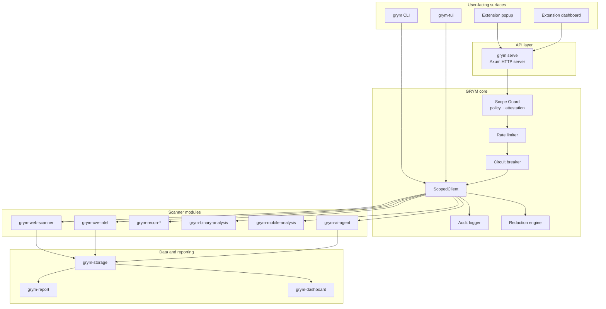
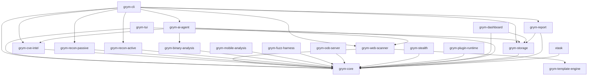
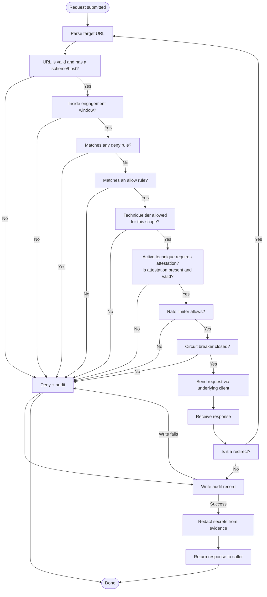
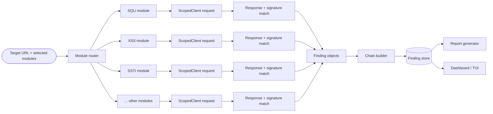
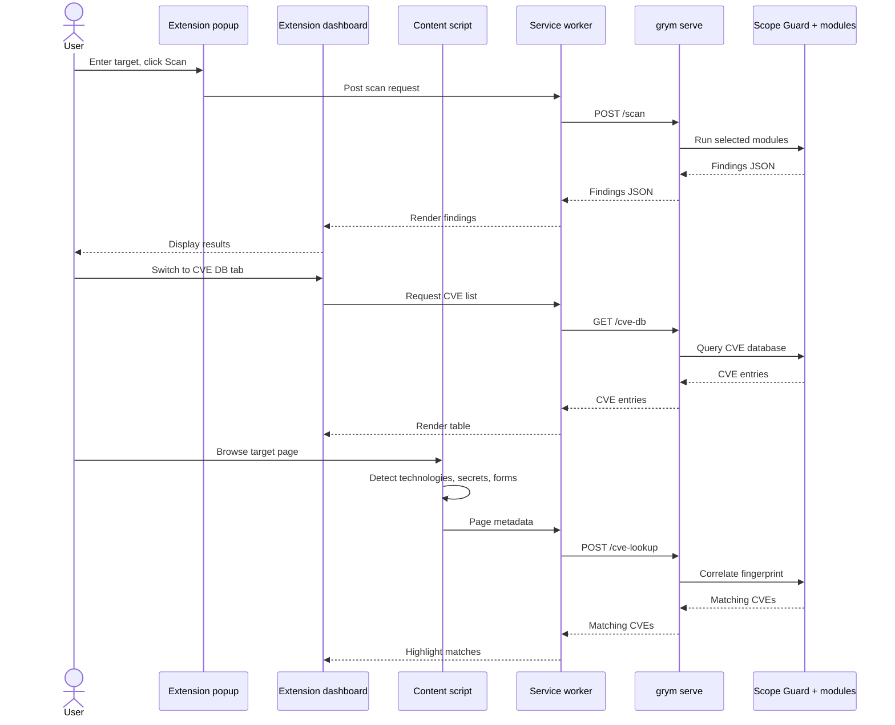
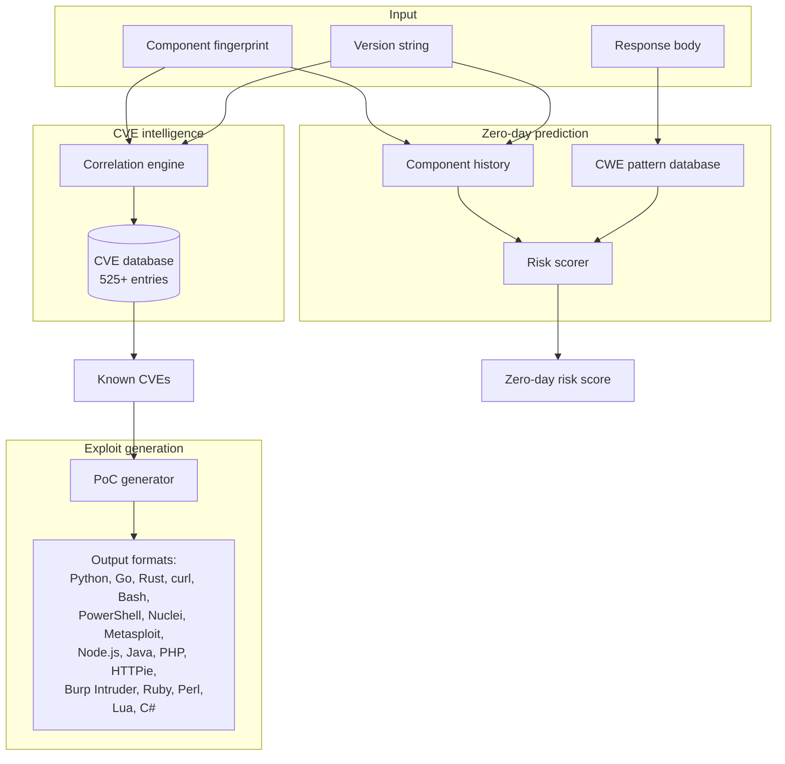
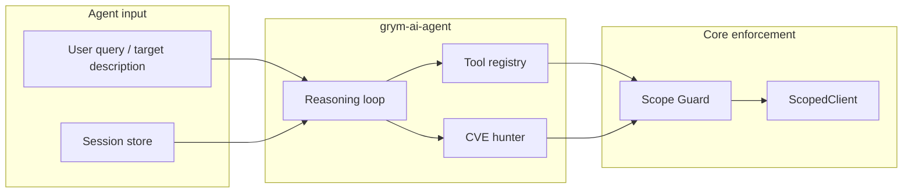
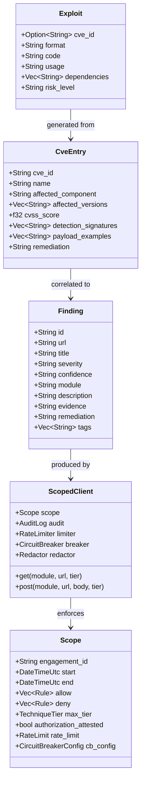

# GRYM Architecture

This document is the deep dive. If the README is the movie trailer, this is the director's commentary, the storyboards, and the safety manual all in one. We will walk through the high-level system, the workspace layout, the Scope Guard lifecycle, the scanner pipeline, the browser extension, the AI agent boundary, and the rules that keep the whole thing from turning into a liability.

---

## Table of contents

1. [Guiding principles](#guiding-principles)
2. [High-level system architecture](#high-level-system-architecture)
3. [Workspace crate dependency map](#workspace-crate-dependency-map)
4. [The Scope Guard lifecycle](#the-scope-guard-lifecycle)
5. [Scanner pipeline](#scanner-pipeline)
6. [Browser extension data flow](#browser-extension-data-flow)
7. [CVE intelligence, exploit generation, and prediction](#cve-intelligence-exploit-generation-and-prediction)
8. [AI agent boundary](#ai-agent-boundary)
9. [Core data model](#core-data-model)
10. [Module boundaries and extension rules](#module-boundaries-and-extension-rules)
11. [Implementation status](#implementation-status)

---

## Guiding principles

GRYM is built around five non-negotiable ideas. Break any of them and the architecture has failed.

1. **Fail-closed by default.** If there is any doubt about whether a request is allowed, it is denied. Doubt includes malformed scope, missing attestation, audit-write failure, and expired windows.
2. **Scope is code, not documentation.** The policy is parsed from a typed file and enforced by `grym_core::ScopedClient`. Operators cannot accidentally disable it with a CLI flag.
3. **Attestation is an action, not a setting.** Active techniques require a typed, in-memory authorization phrase. It cannot be committed to a config file.
4. **Defense in depth.** Rate limits, circuit breakers, redirect re-authorization, and evidence redaction are mandatory, not optional.
5. **Clean module boundaries.** Module crates depend on `grym-core`. They do not talk to the network directly, they do not use `unsafe`, and they do not hardcode taxonomies.

Think of `grym-core` as the nightclub bouncer and the module crates as the party guests. Everyone gets ID-checked at the door, everyone is on the list, and nobody is allowed to sneak in through the kitchen.

---

## High-level system architecture

The diagram shows the separation of concerns: interfaces never touch the network directly, the core owns authorization and transport, modules own detection logic, the AI agent owns reasoning, and storage/reporting crates own persistence and presentation.

---

## Workspace crate dependency map

A few things to notice:

- Every module crate eventually depends on `grym-core`. No module crate depends on another module crate.
- `grym-cli` and `grym-tui` are thin shells. They orchestrate; they do not implement detection.
- `grym-template-engine` is a pure data crate. It knows how to match signatures, not how to fetch them.
- `grym-ai-agent` depends on several module crates but only through their public, safe interfaces. It never talks to the network directly.
- `xtask` is the build-automation crate and only touches stable public interfaces.

---

## The Scope Guard lifecycle

The Scope Guard is the load-bearing safety component. The following diagram shows every decision point an outbound request must survive before it is allowed to leave the process.

Key details:

- **Deny-first.** Deny rules are evaluated before allow rules. A target on the deny list is rejected even if it also matches an allow rule.
- **Engagement window.** Scopes have a start and end time. Outside that window, every request is denied.
- **Technique tiers.** Passive fingerprinting, standard detection, active validation, and exploitation are separate tiers. Higher tiers require higher authorization.
- **Typed attestation.** For active techniques, the operator must supply the exact in-memory phrase `I CONFIRM AUTHORIZATION FOR <ENGAGEMENT_ID>`. It cannot be in a file or environment variable.
- **Redirect re-authorization.** Redirects are disabled in the underlying HTTP client. When a redirect is returned, the target URL is parsed and run through the entire lifecycle again.
- **Audit-write failure is denial.** If the audit record cannot be written, the action fails closed.
- **Redaction.** Secrets in URL query parameters and response bodies are redacted before the response is returned to the caller or stored.

---

## Scanner pipeline

The scanner is deliberately modular:

- Each module is independent. A failure in one module does not stop the others.
- Every module uses `ScopedClient` for every request. There is no back-channel.
- Modules return `Vec<Finding>`. A finding is a plain data struct with severity, confidence, evidence, and remediation.
- The chain builder consumes findings and proposes multi-step attack chains mapped to MITRE ATT&CK techniques.
- Findings are stored, then rendered by report and dashboard crates.

---

## Browser extension data flow

The extension never performs active exploitation itself. It is a polished remote control for the local `grym serve` process. Because the server enables CORS, the dashboard can call it directly from a `chrome-extension://` origin, but all network traffic still goes through the Scope Guard.

---

## CVE intelligence, exploit generation, and prediction

The intelligence subsystem is split into three responsibilities:

- **CVE lookup.** Given a technology fingerprint and version, return matching CVEs with signatures, CVSS, and remediation.
- **Exploit generation.** Given a CVE, emit a safe, local PoC in the requested format. This is source code, not a remote payload. It is up to the operator to use it only inside the authorized scope.
- **Zero-day prediction.** Mine historical patterns and CWE correlations to estimate how likely a component/version is to have an unpatched vulnerability class. This is research-grade inference, not magic.

---

## AI agent boundary

`grym-ai-agent` adds autonomous reasoning on top of the same safe boundaries.

Key points:

- The agent never holds a raw HTTP client. When it needs network data, it calls a tool that routes through `ScopedClient`.
- The tool registry is explicit. Adding a new capability means adding a typed tool, not giving the model an open socket.
- Sessions are bounded and evicted by age/count. The agent cannot accumulate infinite state.
- The CVE hunter generates hypotheses and PoC templates, but the actual execution is delegated to the scanner modules under the same scope rules.

---

## Core data model

The data model is intentionally boring. Findings are plain structs so they can be serialized, stored, and reported without pulling in scanner logic. The `ScopedClient` owns the dangerous state and is the only thing allowed to talk to the network.

---

## Module boundaries and extension rules

If you add a crate or a module, follow these rules. They are not suggestions.

1. **Module crates depend on `grym-core`.** They do not depend on other module crates. If two modules need shared logic, put it in `grym-core` or create a utility crate that does not touch the network.
2. **No raw network clients.** Do not import `reqwest`, `hyper`, `ureq`, `std::net::TcpStream`, or browser networking APIs inside module crates. Route everything through `ScopedClient`.
3. **`unsafe` is forbidden.** The workspace lint denies `unsafe_code`. If you think you need it, open an issue first and prepare a very strong argument.
4. **No `unwrap`, `expect`, `panic`, `todo`, or `unimplemented`.** Use proper error types and propagate them.
5. **Detection is non-destructive by default.** A module that actively mutates state belongs behind the explicit technique-tier and attestation APIs.
6. **Taxonomies live in mapping packs.** Do not hardcode category strings in scanner logic. If a new vulnerability class is added, it is added to the mapping pack and the scanner consumes it.
7. **Evidence is redacted before storage.** If your module captures a response, run it through the redactor before returning it.
8. **Tests are mandatory.** Every scope decision path and every detection heuristic needs deterministic tests. A regression that expands scope is a release blocker.

---

## Implementation status

### Implemented now

- Phase 0 scope schema, typed attestation gate, deny-first policy evaluation, structured audit trail, bounded scoped HTTP, rate limits, and circuit breaker.
- `grym-cli` with `scope validate`, `scope show`, and `serve`.
- `grym-web-scanner` with 20+ detection modules, fuzzer, chain builder, 525+ entry CVE DB, exploit generator, and payload generator.
- `grym-cve-intel` with zero-day prediction engine and response-body analysis.
- `grym-tui` with dashboard, scanner, findings, logs, and config tabs; full mouse support and a scrollable help overlay.
- Cross-browser Manifest V3 extension in `browser-ext/` with GRYM logo icons.
- `grym-ai-agent` with session management, tool registry, and autonomous CVE hunting.
- Versioned mapping packs, safe signature-template parsing, and fixture definitions.
- Cross-platform CI configuration, editor setup, dependency-policy configuration, and mapping validation.

### Planned behind the established interfaces

- Actual DNS/CT collection, port scanning, and crawling.
- OOB server listener with correlation IDs.
- Live CVE feed adapters and automated enrichment.
- Binary and mobile parser backends.
- Durable `redb` storage, PDF/SARIF reporting, and WASM plugin host.
- Scheduled dashboard jobs and long-running campaign orchestration.

---

**In short:** interfaces ask, the core decides, modules detect, the agent reasons, storage remembers, and the Scope Guard keeps everyone honest. Build accordingly.
